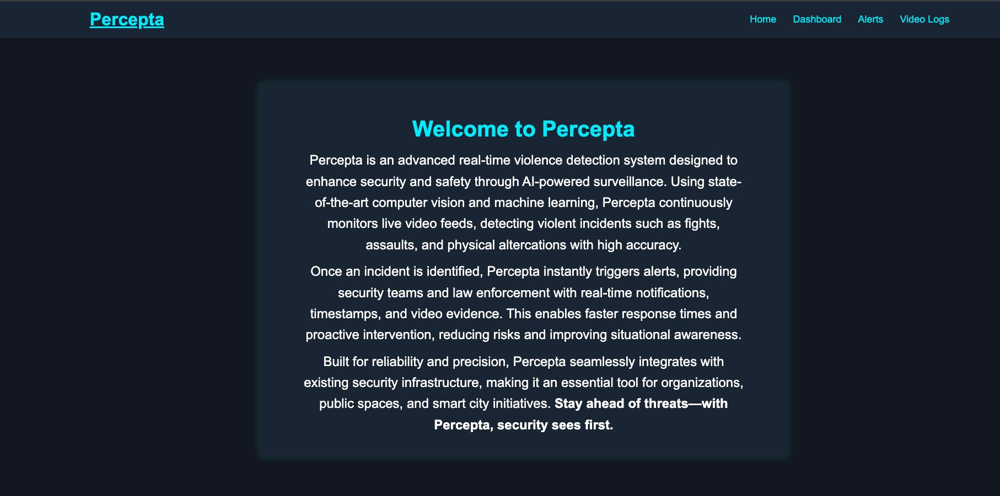
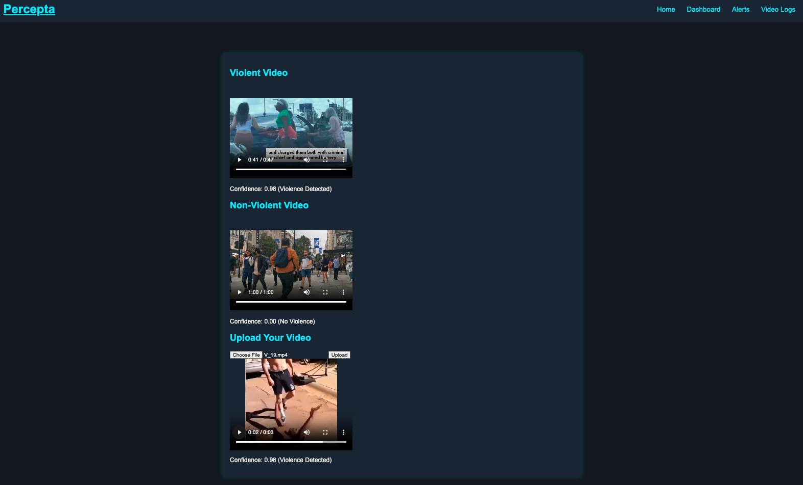
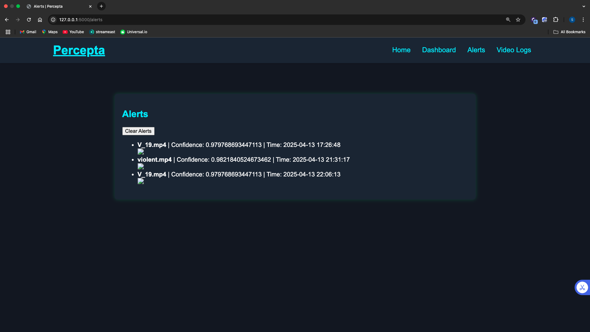
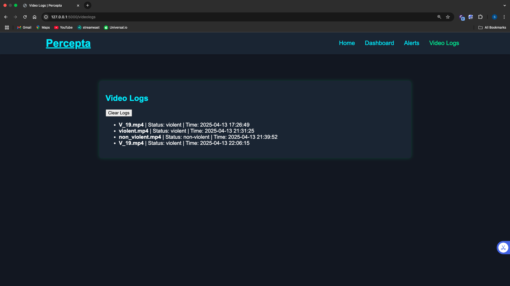

# Percepta: Real-Time Violence Detection System

https://drive.google.com/drive/folders/1EHjW2zuPigaluKGh0MK6NG4_gt8efNEv?usp=drive_link : H5 file to run the code 

**Percepta** is an advanced AI-powered surveillance system designed to detect violent activities in video streams. Using a deep learning model and a Flask web application, Percepta analyzes live or uploaded video files to determine whether violence is present and provides confidence scores alongside visual alerts and email notifications.
---

## 📂 Project Structure
```
├── ViolenceDetectionProject
│   ├── Templates
│   ├── __pycache__
│   ├── app.py
│   ├── captures
│   ├── detect.py
│   ├── init_db.py
│   ├── lk
│   ├── model.h5
│   ├── requirements.txt
│   ├── static
│   ├── venv
│   ├── video_logs.db
│   └── violence_log.db
```

## 💡 Features

- 🔍 Real-time violence detection using a CNN+LSTM model
- 🎥 Analyze 3 video streams: violent, non-violent, and uploaded
- ✅ Displays confidence score dynamically under each video
- ✉️ Sends email alerts with timestamp + frame snapshot
- 📸 Captures and stores violent frames in `captures/`
- 📋 Maintains logs for all uploads and alerts
- 🔄 Clear alerts and video logs via dashboard buttons

---
## ⚠️ Warning 

No Video should be longer than 1-2 minutes unless your glad to be waiting for long duration. Only recomended for CCTV videos. So I would advise downloading a video from youtube and trim  the video to 1-2 minutes of cctv video of non violence and violence to see each other confidence score. Still in Develop stage of doing anytype of videos but at the moment CCTV videos are only recommended. 

---

## 🚀 How to Run

1. **Clone the Repo**
   ```sh
   $ git clone https://github.com/your-username/ViolenceDetectionProject.git
   $ cd ViolenceDetectionProject

2. Create Virtual Environment
   ```sh
   python3 -m venv venv
   source venv/bin/activate

3. Install Dependencies
   ```sh
   pip install -r requirements.txt

4. Set Up Environment Variables

   Create a .env file in the root directory:
   ```sh
   GMAIL_USER=your_email@gmail.com

   GMAIL_PASS=your_app_password
    ```
   ⚠️ If using Gmail, enable 2FA and generate an App Password: Google App Passwords

4. Initialize Databases
   ```sh
   python init_db.py

7. Run the App
   ```sh
   python app.py

   Then open your browser and go to:
   http://127.0.0.1:5000


## 🛠 Built With
Python

Flask

OpenCV

TensorFlow

SQLite

HTML/CSS

JavaScript (AJAX)

## 📸 Screenshots

### 🏠 Home Page (Percepta Intro)
Shows branding and introduction to the system.


### 📊 Dashboard
Displays three video feeds (violent, non-violent, uploaded) with real-time confidence scores.


### 🚨 Alerts Tab
Logs detected violence events with captured frame, confidence score, and timestamp.


### 🎞️ Video Logs
Lists all uploaded videos and their classification (violent or non-violent).


